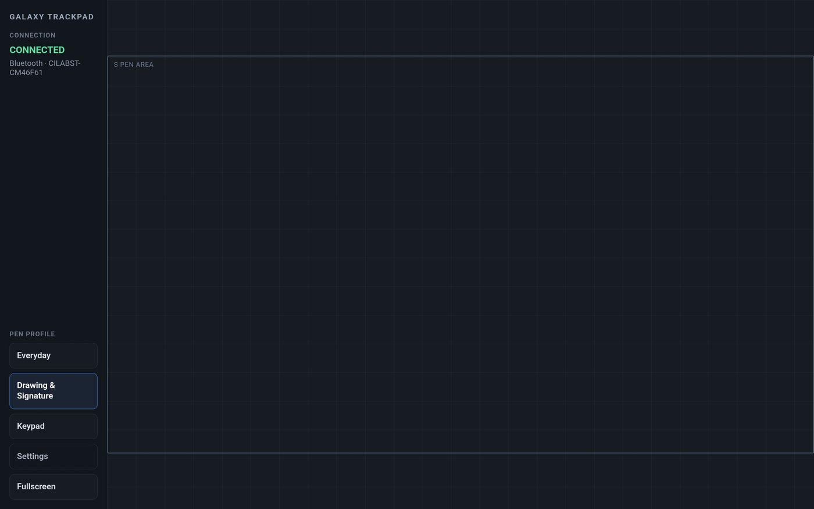
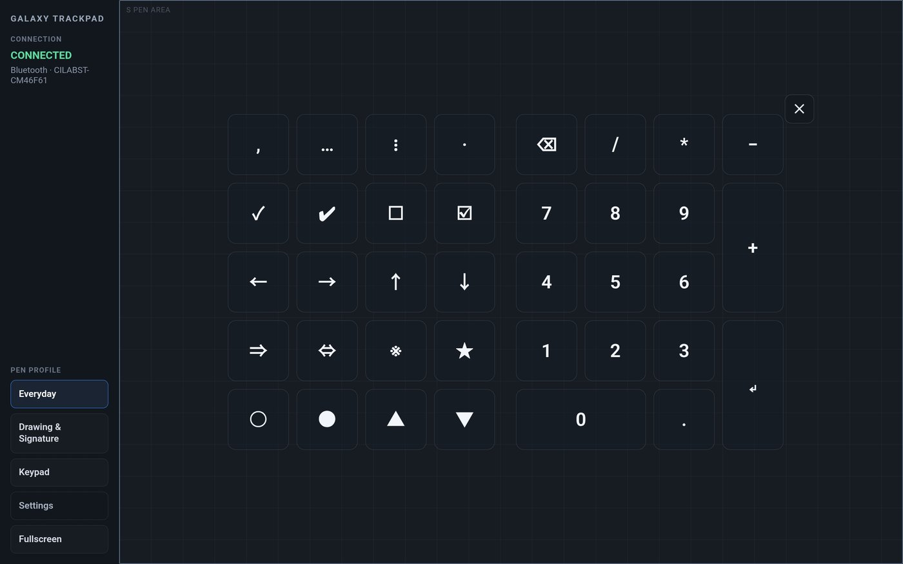
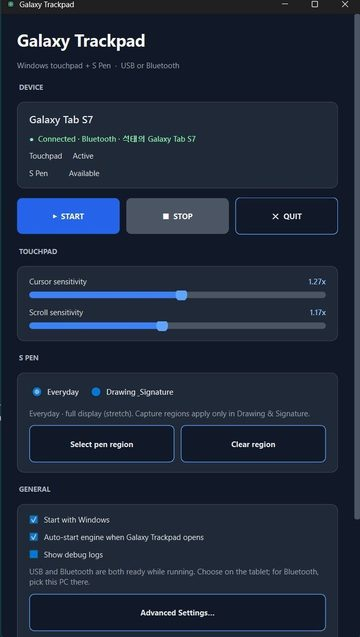
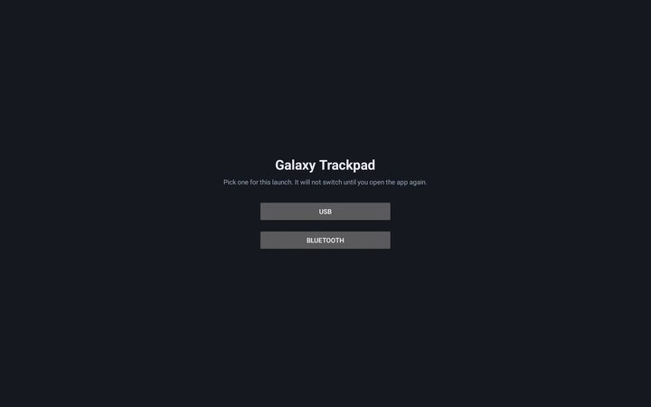
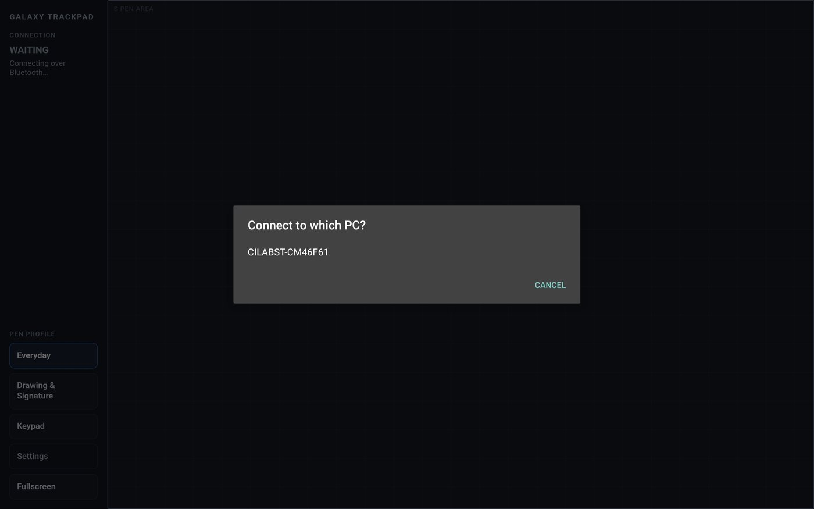
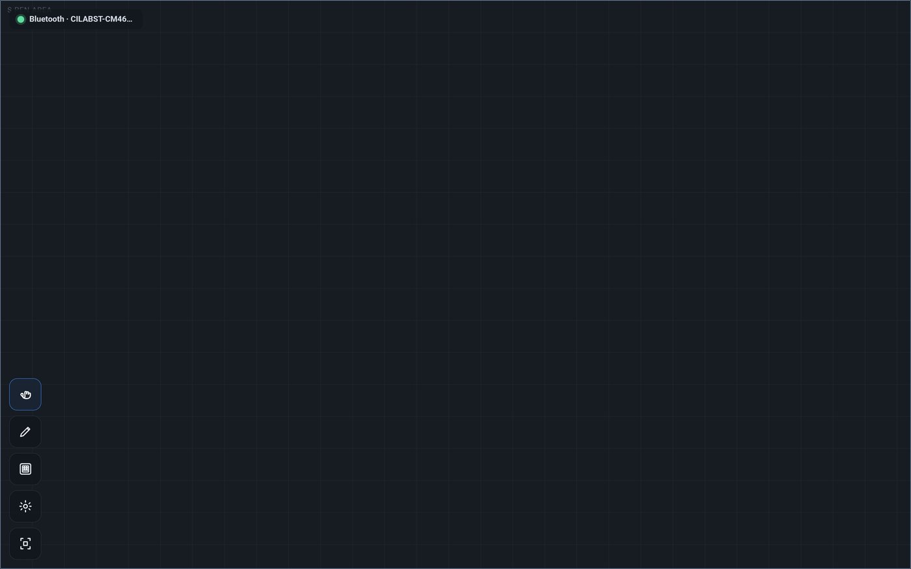
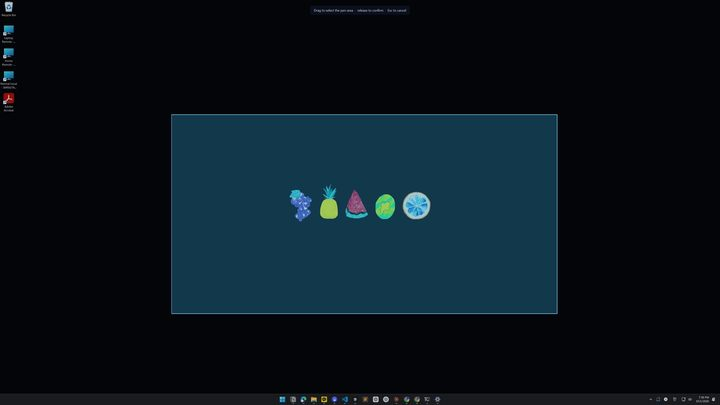
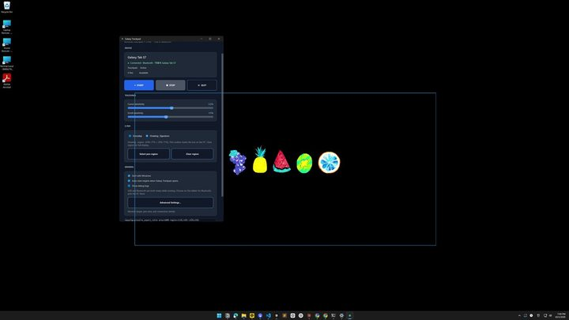
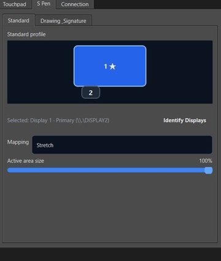

# Galaxy Trackpad

**Turn an Android phone or tablet into a native Windows Precision Touchpad.**

Use an idle Galaxy phone, Galaxy Tab, or similar Android device as a Windows trackpad — and optionally as an S Pen tablet when the hardware supports it — without a custom kernel driver and without the Play Store.

**Latest release: [v0.12.1](https://github.com/sansiuchicom/galaxy-trackpad/releases/tag/v0.12.1)** · pre-1.0 daily driver · not on any app store

[Download v0.12.1](https://github.com/sansiuchicom/galaxy-trackpad/releases/tag/v0.12.1) · [Install guide](docs/INSTALL.md) · [Bluetooth notes](docs/BLUETOOTH.md)

---

## Demo

Three highlights — same pad on the Android device and Windows (USB or Bluetooth).

<p align="center">
  
  &nbsp;
  
  &nbsp;
  
</p>

<p align="center">
  <sub>Connected pad · Keypad · Windows app</sub>
</p>

<details>
<summary>More screenshots</summary>

#### Connect — device picks the path

Launch on the phone or tablet, choose **USB or Bluetooth**, then (on Bluetooth) pick the PC.

<p align="center">
  
  &nbsp;
  
  &nbsp;
  
</p>

<p align="center">
  <sub>1 · USB or Bluetooth &nbsp;&nbsp;·&nbsp;&nbsp; 2 · Pick this PC &nbsp;&nbsp;·&nbsp;&nbsp; 3 · Fullscreen icon rail</sub>
</p>

#### S Pen region — draw only where you want

On Windows, drag a capture-style region, see the outline while Drawing, and map the pen to a monitor.

<p align="center">
  
  &nbsp;
  
  &nbsp;
  
</p>

<p align="center">
  <sub>1 · Drag a region &nbsp;&nbsp;·&nbsp;&nbsp; 2 · Outline while Drawing &nbsp;&nbsp;·&nbsp;&nbsp; 3 · Map to a monitor</sub>
</p>

</details>


## Features

- **Native Windows Precision Touchpad** — 1–5 fingers; tap, scroll, pinch; system 3- and 4-finger gestures; separate **cursor / scroll / pinch zoom** sensitivity in the Windows app
- **S Pen → Windows pen** — pressure and tilt when the device supports it; Everyday / Drawing profiles; optional capture-style region
- **Pop-up keypad** — 2 pages (symbols + Win-style numpad), editable left symbols from Windows; see [docs/KEYPAD_PLAN.md](docs/KEYPAD_PLAN.md)
- **USB or Bluetooth** — choose on the Android device at launch (one transport per session)
- **No browser UI** — Android app + Windows app; no typing `http://127.0.0.1…`
- **Windows tray app** — auto engine start, USB reverse ports, Bluetooth advertising while running, optional start with Windows

---

## Download

From **[v0.12.1 on GitHub Releases](https://github.com/sansiuchicom/galaxy-trackpad/releases/tag/v0.12.1)**:

| File | Purpose |
|------|---------|
| [**GalaxyTrackpad-windows-v0.12.1.zip**](https://github.com/sansiuchicom/galaxy-trackpad/releases/download/v0.12.1/GalaxyTrackpad-windows-v0.12.1.zip) | Windows app + bundled `platform-tools` (ADB) |
| [**GalaxyTrackpad-v0.12.1.apk**](https://github.com/sansiuchicom/galaxy-trackpad/releases/download/v0.12.1/GalaxyTrackpad-v0.12.1.apk) | Android app |
| [GalaxyTrackpad-android-v0.12.1.zip](https://github.com/sansiuchicom/galaxy-trackpad/releases/download/v0.12.1/GalaxyTrackpad-android-v0.12.1.zip) | Same APK, packaged as a zip |

Keep the Windows folder intact after unzip (`GalaxyTrackpad.exe`, `_internal`, `platform-tools`).

---

## Quick install

Full step-by-step: **[docs/INSTALL.md](docs/INSTALL.md)**.

```text
1. Unzip and run GalaxyTrackpad.exe on Windows
2. Install the APK on the Android device
3. Open the app → choose USB or Bluetooth
4. Wait for CONNECTED → use the pad
```

| Path | What you do |
|------|-------------|
| **USB** | Enable USB debugging, plug in a data cable, choose **USB** on the device |
| **Bluetooth** | Pair device ↔ PC in system Bluetooth settings once, start the Windows app, choose **Bluetooth** and pick the PC |

The Windows engine stays ready for **both** USB and Bluetooth while it is running. You pick the transport on the Android device; there is no PC-side mode switch.

---

## Compatibility

| | Status |
|---|--------|
| **Verified** | Windows **11**; Samsung **Galaxy Tab S7 (SM-T870)**; Samsung **Galaxy S24 (SM-S921N)** |
| **Android app** | `minSdk` 28 (Android 9+) — phones and tablets |
| **Other Android devices** | Likely to work for basic touch if USB debugging / Bluetooth Classic work; **not verified** |
| **S Pen / stylus** | Verified on Tab S7 S Pen; phone / other styli untested |
| **Windows 10** | Not verified |
| **macOS / Linux PC** | Not supported (Windows input injection) |

Honest limits:

- **Bluetooth** adds a small smoothing delay (on the order of tens of milliseconds). Prefer **USB** for drawing if you notice lag.
- One Android device session at a time; one transport per app launch (no mid-session USB ↔ Bluetooth switch).
- USB needs **ADB reverse** (the Windows package bundles `platform-tools` and sets this up for you).
- Bluetooth needs a normal OS **pairing** first; the device then dials the PC by service UUID (RFCOMM). Details: [docs/BLUETOOTH.md](docs/BLUETOOTH.md).

---

## FAQ

**Do I need root or the Play Store?**  
No. Install the APK (sideload) and run the Windows zip. No custom kernel, no store listing.

**USB: the device does not connect. What should I check?**  
USB debugging on, a data-capable cable, accept the PC authorization prompt, and keep `GalaxyTrackpad.exe` running. On the phone/tablet choose **USB**, then wait for CONNECTED. Full steps: [docs/INSTALL.md](docs/INSTALL.md).

**USB or Bluetooth — which should I use?**  
Prefer **USB** when you care about latency (drawing). Use **Bluetooth** when you want wireless after a normal OS pairing. The Windows app advertises both while it runs; you pick the transport on the Android device (one per launch). Bluetooth notes: [docs/BLUETOOTH.md](docs/BLUETOOTH.md).

---

## Requirements

- Windows PC (tested on Windows 11)
- Android phone or tablet (verified: Galaxy Tab S7, Galaxy S24)
- For install: way to get the APK onto the device
- For USB use: USB debugging + data-capable cable
- For Bluetooth use: Bluetooth on both devices, paired in system settings

---

## Settings (where things live)

| What | Where |
|------|--------|
| Cursor / scroll / pinch zoom sensitivity | Windows app |
| Keypad left symbols (per page) | Windows app → **Edit keypad symbols…** |
| Everyday / Drawing pen profile | Windows or Android (saved on Windows) |
| Monitor / pen area / mapping | Windows **Advanced** |
| Pop-up keypad (digits + symbols) | Tablet **Keypad** button — [docs/KEYPAD_PLAN.md](docs/KEYPAD_PLAN.md) |
| Start with Windows, auto-start engine | Windows app |
| Fullscreen pad UI | Android app |

Packaged app settings file: `galaxytrackpad_settings.json` next to `GalaxyTrackpad.exe` (created on first run).

---

## Build from source (developers)

```powershell
# From a clone of this repo
conda env create -f environment.yml   # once
conda activate galaxytrackpad
python -m windows
# or package the exe:
powershell -ExecutionPolicy Bypass -File packaging\build_windows.ps1
```

Android (JDK 17):

```powershell
cd android
.\gradlew.bat assembleRelease
# APK: app\build\outputs\apk\release\app-release.apk
```

More: [packaging/README.md](packaging/README.md), [android/README.md](android/README.md).

### Localhost ports

| Port | Role |
|------|------|
| 8765 | HTTP (pad HTML, USB) |
| 8766 | WebSocket (input + state, USB) |
| 8767 | Windows GUI ↔ engine |

### Tests

```powershell
python -m unittest tests.test_pen_mapping tests.test_keyboard -v
```

Manual checklist: [tests/REGRESSION.md](tests/REGRESSION.md). Keypad design/protocol: [docs/KEYPAD_PLAN.md](docs/KEYPAD_PLAN.md).

---

## Project status

| Area | Status |
|------|--------|
| Windows engine + Android WebView | Done |
| Packaged Windows exe + signed APK | Done (`v0.9.1`+) |
| Bluetooth RFCOMM transport | Done (`v0.10.0`) |
| Pop-up keypad (pages + custom symbols) | Done (`v0.12.0`) — [docs/KEYPAD_PLAN.md](docs/KEYPAD_PLAN.md) |
| Pinch zoom sensitivity slider | Done (`v0.12.0`) — Cursor / Scroll / Pinch in Windows app |
| Phone-friendly keypad fit + S24 verify | Done (`v0.12.1`) |
| Longer soak / polish | In progress |
| **1.0.0** | After real-world soak |

Ideas and issues from daily use (not scheduled): **[docs/BACKLOG.md](docs/BACKLOG.md)**.  
Lab tools used while building Bluetooth: [bluetooth_lab/README.md](bluetooth_lab/README.md). Older prototypes: `archive/`.

---

## License

[MIT](LICENSE) — free to use, modify, and share, including commercially.

Third-party components keep their own terms (for example **PySide6** is LGPL;
**AndroidX** is Apache-2.0). Redistributing the Windows binary must still
satisfy those dependency licenses.

---

## Notes

- Gestures are handled by Windows, not remapped to keys on Android.
- Release binaries live on **GitHub Releases** only (`dist/`, `releases/`, `*.apk` are gitignored).
- The Android signing keystore stays on the maintainer’s machine (never commit `*.jks` or `keystore.properties`).
